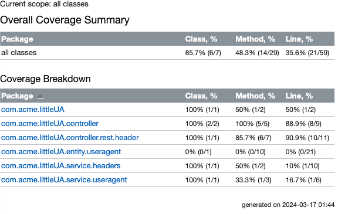

# LittleUA

## DB init
1. `cd docker/`
2. `docker compose up`

## APIs 
[Exported Postman API collection for LittleUA](./extra/littleUA.postman_collection.json)

| Method | Endpoint        | Description                                                                         | Response example                                                                                                                                                                                                                                            |
|--------|-----------------|-------------------------------------------------------------------------------------|-------------------------------------------------------------------------------------------------------------------------------------------------------------------------------------------------------------------------------------------------------------|
| GET    | /headers/mirror | Mirrors the client's headers                                                        | `[{"name": "user-agent","value": "Mozilla/5.0 (Macintosh; Intel Mac OS X 10_15_7) AppleWebKit/537.36 (KHTML, like Gecko) Chrome/122.0.0.0 Safari/537.36"},{"name": "accept","value": "*/*"}, ...]`                                                          | 
| POST   | /useragents     | Saves or updates the client's useragent                                             | `Mozilla/5.0 (Macintosh; Intel Mac OS X 10_15_7) AppleWebKit/537.36 (KHTML, like Gecko) Chrome/122.0.0.0 Safari/537.36`                                                                                                                                     |
| GET    | /useragents     | Returns last (up to 10) recorded useragents ordered by their updated timestamp DESC | `[{"id": "c71f40c4c7c8ef37a87c01ff36e55e29a97d7b37b42290f2f256d4d2c7267d04","useragent": "Mozilla/5.0 (Macintosh; Intel Mac OS X 10_15_7) AppleWebKit/537.36 (KHTML, like Gecko) Chrome/122.0.0.0 Safari/537.36", "updated": "2024-03-16 23:06:03"}, ... ]` |

### Test Coverage 85.7%

